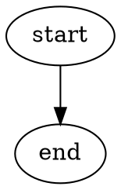

# Project Docs Guide

## Goal

Provide a fallback project documentation structure when the target project has no existing documentation structure.

Use this file from `implement` only after inspecting the workspace and failing to find project documentation conventions.

## Rules

- Prefer the target project's existing documentation structure.
- Use this guide only as a fallback recommendation.
- Keep project docs outside `.monado/workflow/`.
- Track project docs with the same source control as code.
- Create only the docs needed for the current implementation.
- Update the nearest `index.md` when adding, moving, or removing a child document or folder.

## When to Update Docs

Update project docs when implementation changes information future work needs to rely on:

- Architecture, module responsibility, or subsystem boundaries.
- Public APIs, commands, data formats, configuration, or compatibility contracts.
- User-visible feature behavior.
- Control flow, data flow, state machines, or operational flows.
- Engineering policies, conventions, or constraints.
- Research, decisions, or project knowledge that affects future implementation.

Avoid documentation churn for internal changes that do not affect future understanding, unless existing docs would become misleading.

## Progressive Disclosure

Use `index.md` at every folder level.

Each `index.md` should state:

- What this folder is for.
- What files or subfolders exist below it.
- When to read each child document.
- Which child documents matter most during implementation.

## Fallback Structure

When no project documentation structure exists, start with `docs/`:

```text
docs/
├── index.md
├── architecture/
│   ├── index.md
│   ├── overview.md
│   ├── api-reference/
│   │   ├── index.md
│   │   └── <module-or-service>.md
│   └── flows/
│       ├── index.md
│       └── <flow-name>.md
├── features/
│   ├── index.md
│   └── <feature-name>.md
├── policies/
│   ├── index.md
│   └── <policy-name>.md
└── knowledge/
    ├── index.md
    ├── decisions/
    │   ├── index.md
    │   └── <decision-name>.md
    └── research/
        ├── index.md
        └── <research-topic>.md
```

Do not create the full tree by default. Create the smallest useful set of folders and files for the current implementation.

## Content Types

Use project docs for:

- Project architecture and subsystem responsibility.
- Feature behavior.
- Process, control-flow, data-flow, and state-machine diagrams.
- API Reference by module, package, service, command, or public interface.
- Engineering policies such as coding style, naming, testing, and architecture rules.
- Knowledge documents, research notes, and decision records.

Embed Graphviz dot directly in Markdown when useful:



## Implementation Recording

When project docs change during `implement`, record in the implementation document:

- Document path.
- Reason for the update.
- Related spec checklist item or implementation change.
- Whether the nearest `index.md` was updated.

When no project docs are needed, record that decision and why.
