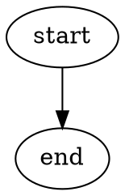

# Project Docs Guide

## Purpose

Guide fallback project documentation structure when a target project has no existing documentation structure.

Project docs are long-lived project assets. Store them in the target project documentation area, usually `docs/`, and track them with the same source control as code. Workflow documents remain under `.monado/workflow/`.

Use this guide from `implement` only after inspecting the workspace and failing to find an existing project documentation structure. Existing project documentation conventions take precedence over this guide.

## When to Update Project Docs

Update project docs when the implementation changes information that future work needs to rely on, such as:

- Architecture, module responsibility, or subsystem boundaries.
- Public APIs, commands, data formats, configuration, or compatibility contracts.
- User-visible feature behavior.
- Important control flow, data flow, state machines, or operational flows.
- Engineering policies, conventions, or constraints.
- Research, decisions, or project knowledge that affects future implementation.

Avoid documentation churn for purely internal changes that do not change future understanding, unless the current docs would become misleading.

## Location Selection

Before creating new docs, inspect the target project for an existing documentation structure.

- If a structure already exists, follow it.
- If there is no project documentation structure, use `docs/`.
- Keep project docs outside `.monado/workflow/`.
- Treat project docs as source-controlled project files.

## Progressive Disclosure

Use progressive disclosure for project docs.

Every folder level should contain an `index.md` file. Each `index.md` should explain:

- The purpose of that folder.
- What files or subfolders exist below it.
- When an agent or developer should read each child document.
- Which child documents are most important for implementation work.

When adding, moving, or removing a child document or folder, update the nearest `index.md`.

## Suggested Structure

When the target project has no existing documentation structure, use this structure as the default starting point:

```text
docs/
├── index.md
├── architecture/
│   ├── index.md
│   ├── overview.md
│   ├── api-reference/
│   │   ├── index.md
│   │   └── <module-or-service>.md
│   └── flows/
│       ├── index.md
│       └── <flow-name>.md
├── features/
│   ├── index.md
│   └── <feature-name>.md
├── policies/
│   ├── index.md
│   └── <policy-name>.md
└── knowledge/
    ├── index.md
    ├── decisions/
    │   ├── index.md
    │   └── <decision-name>.md
    └── research/
        ├── index.md
        └── <research-topic>.md
```

The structure is a recommendation, not a required full scaffold. Create only the folders and documents needed for the current implementation.

## Content Types

Project docs may include:

- Project architecture and subsystem responsibility.
- Feature documents and user-visible behavior.
- Process, control-flow, data-flow, and state-machine diagrams.
- API Reference by module, package, service, command, or public interface.
- Engineering policies such as coding style, naming, testing, and architecture rules.
- Knowledge documents, research notes, and decision records.

Flow diagrams may be stored as Markdown documents. Graphviz dot can be embedded directly in Markdown fenced code blocks:



## Implementation Recording

When project docs are added or updated during `implement`, record them in the implementation document:

- Document path.
- Reason for the update.
- Related spec checklist item or implementation change.
- Whether the nearest `index.md` was updated.

If no project docs were needed, record that decision and why.
